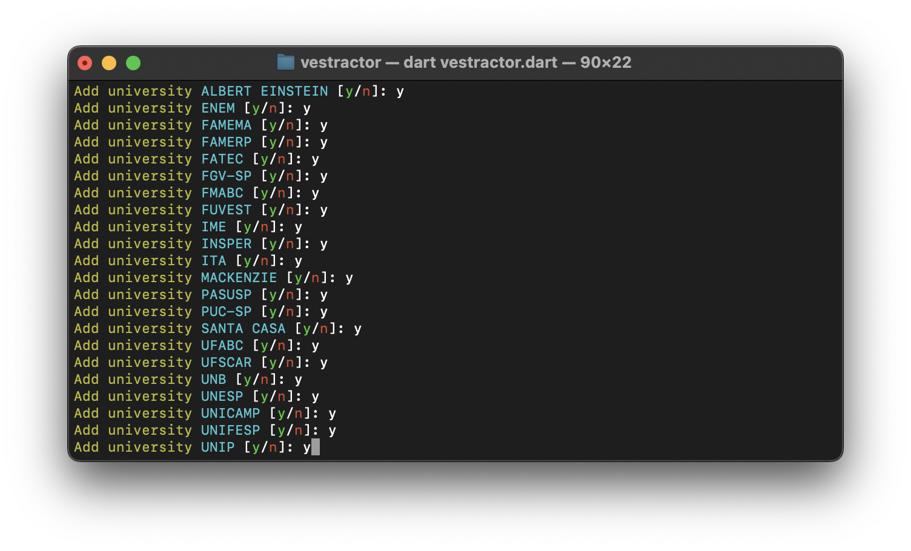

# About Vestractor

This interactive command line ([CLI](https://en.wikipedia.org/wiki/Command-line_interface)) software is capable of extracting image links of solved questions from the main Brazilian entrance exams, from [web-scraping](https://en.wikipedia.org/wiki/Web_scraping) on the [Curso Objetivo](https://www.curso-objetivo.br/vestibular/resolucao_comentada.aspx) website. This information and metadata is saved in JSON format, in an organized and ready-to-read manner.

## Prerequisites

To use the program, you need to have the [Dart SDK](https://dart.dev/get-dart) installed on your computer, at least version `v3.1.0`. Make sure the Dart binaries are in your operating system's global variable of type `$PATH`.

## Dependencies

Install the dependencies required by this software, indicated in the [pubspec.yaml](./pubspec.yaml) file, using the following command:

```shell
dart pub get
```

## Execution

With Dart installed and configured correctly on your system, open the folder containing this project with your terminal and run the following command:

```shell
dart vestractor.dart
```

## Compilation

You can compile this project to an executable binary using the following command:

```shell
dart compile exe vestractor.dart
```

## Output

Each file generated relating to a university is saved in the [data](./data) folder as a [JSON](https://en.wikipedia.org/wiki/JSON) file, following the following structure:

```json
{
  "name": "University name",
  "url": "https://university-url.br",
  "exams": [
    {
      "name": "Exam name",
      "url": "https://exam-url.br",
      "questions": [
        {
          "name": "Question name",
          "url": "https://question-url.br",
          "area": "Question area (or empty string)",
          "alternative": "Question alternative (or empty string)",
        }
      ]
    }
  ]
}
```

## Preview

The following image illustrates Vestractor working from a command line:

<p align="center">
   
</p>